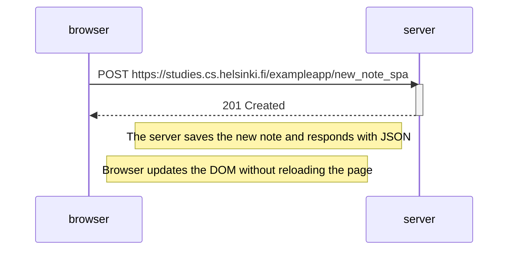

```mermaid
sequenceDiagram
    participant browser
    participant server

    browser->>server: POST https://studies.cs.helsinki.fi/exampleapp/new_note_spa
    activate server
    server-->>browser: 201 Created
    deactivate server

    Note left of server: The server saves the new note and responds with JSON
    Note right of browser: Browser updates the DOM without reloading the page
```
